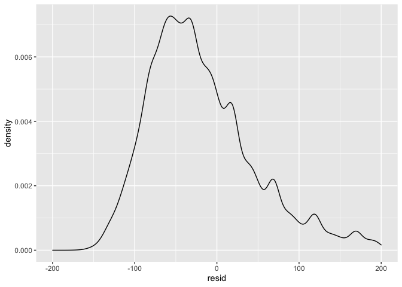
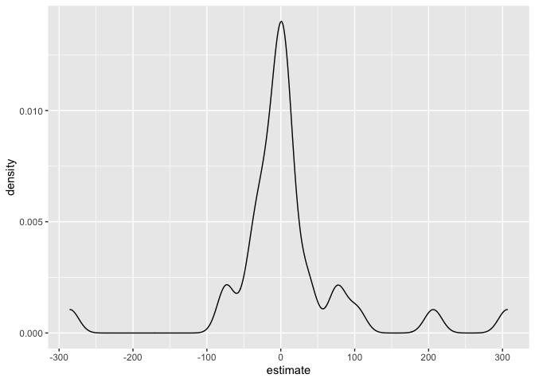
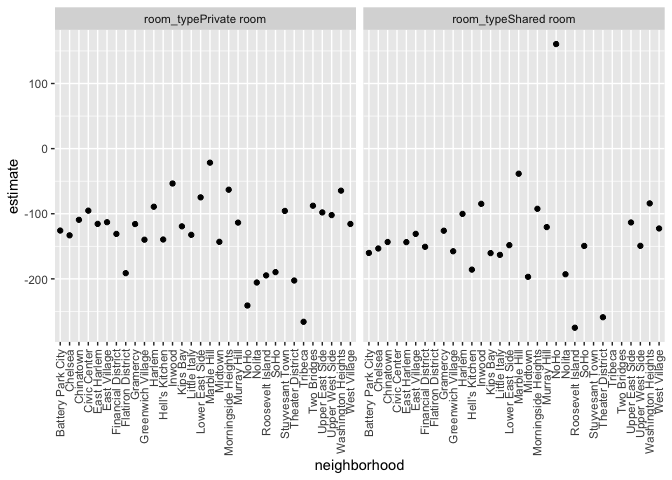

Linear Models
================
Anna Ma
11/16/2021

``` r
library(tidyverse)
library(p8105.datasets)
```

Load NYC Airbnb data

``` r
data("nyc_airbnb")

nyc_airbnb = 
  nyc_airbnb %>% 
  mutate(stars = review_scores_location / 2) %>%
  rename(
    borough = neighbourhood_group,
    neighborhood = neighbourhood) %>% 
  filter(borough != "Staten Island") %>% 
  select(price, stars, borough, neighborhood, room_type)
```

Visualizations..

``` r
nyc_airbnb %>% 
  ggplot(aes(x = stars, y = price)) +
  geom_point()
```

    ## Warning: Removed 9962 rows containing missing values (geom_point).

<!-- -->

Let’s fit a linear model (usually need to plot more and observe
association between variables before actually fitting the regression)

``` r
fit = lm(price ~ stars + borough, data = nyc_airbnb)

#we can also do summary(fit) to see more information about the regression 

#Putting the result in a dataframe: 
fit %>% 
  broom::tidy() %>% 
  mutate(term = str_replace(term, "borough", "Borough: ")) %>% 
  select(term, estimate, p.value) %>% 
  knitr::kable()
```

| term               |  estimate |   p.value |
|:-------------------|----------:|----------:|
| (Intercept)        | -70.41446 | 0.0000005 |
| stars              |  31.98989 | 0.0000000 |
| Borough: Brooklyn  |  40.50030 | 0.0000022 |
| Borough: Manhattan |  90.25393 | 0.0000000 |
| Borough: Queens    |  13.20617 | 0.1451682 |

## Diagnostics

Compare residuals and have result in a data frame

``` r
modelr::add_residuals(nyc_airbnb, fit)
```

    ## # A tibble: 40,492 × 6
    ##    price stars borough neighborhood room_type        resid
    ##    <dbl> <dbl> <chr>   <chr>        <chr>            <dbl>
    ##  1    99   5   Bronx   City Island  Private room      9.47
    ##  2   200  NA   Bronx   City Island  Private room     NA   
    ##  3   300  NA   Bronx   City Island  Entire home/apt  NA   
    ##  4   125   5   Bronx   City Island  Entire home/apt  35.5 
    ##  5    69   5   Bronx   City Island  Private room    -20.5 
    ##  6   125   5   Bronx   City Island  Entire home/apt  35.5 
    ##  7    85   5   Bronx   City Island  Entire home/apt  -4.53
    ##  8    39   4.5 Bronx   Allerton     Private room    -34.5 
    ##  9    95   5   Bronx   Allerton     Entire home/apt   5.47
    ## 10   125   4.5 Bronx   Allerton     Entire home/apt  51.5 
    ## # … with 40,482 more rows

Graph the residual

``` r
modelr::add_residuals(nyc_airbnb, fit) %>% 
  ggplot(aes(x = stars, y = resid)) +
  geom_point()
```

    ## Warning: Removed 9962 rows containing missing values (geom_point).

<!-- -->

``` r
modelr::add_residuals(nyc_airbnb, fit) %>% 
  ggplot(aes(x = resid)) +
  geom_density() + 
  xlim(-200, 200)
```

    ## Warning: Removed 11208 rows containing non-finite values (stat_density).

<!-- -->

## Interactions? Nesting?

Let’s try a different model

``` r
fit = lm(price ~ stars * borough + room_type * borough, data = nyc_airbnb)

broom::tidy(fit)
```

    ## # A tibble: 16 × 5
    ##    term                                   estimate std.error statistic   p.value
    ##    <chr>                                     <dbl>     <dbl>     <dbl>     <dbl>
    ##  1 (Intercept)                               90.1       75.4    1.19   0.232    
    ##  2 stars                                      4.45      16.6    0.267  0.789    
    ##  3 boroughBrooklyn                          -20.4       77.1   -0.265  0.791    
    ##  4 boroughManhattan                           5.63      77.8    0.0723 0.942    
    ##  5 boroughQueens                              1.51      83.5    0.0181 0.986    
    ##  6 room_typePrivate room                    -52.9       17.8   -2.98   0.00288  
    ##  7 room_typeShared room                     -70.5       41.6   -1.70   0.0896   
    ##  8 stars:boroughBrooklyn                     16.5       17.0    0.973  0.331    
    ##  9 stars:boroughManhattan                    22.7       17.1    1.33   0.185    
    ## 10 stars:boroughQueens                        5.21      18.3    0.285  0.776    
    ## 11 boroughBrooklyn:room_typePrivate room    -39.3       18.0   -2.18   0.0292   
    ## 12 boroughManhattan:room_typePrivate room   -71.3       18.0   -3.96   0.0000754
    ## 13 boroughQueens:room_typePrivate room      -16.3       19.0   -0.859  0.390    
    ## 14 boroughBrooklyn:room_typeShared room     -35.3       42.9   -0.822  0.411    
    ## 15 boroughManhattan:room_typeShared room    -83.1       42.5   -1.96   0.0503   
    ## 16 boroughQueens:room_typeShared room       -24.4       44.4   -0.550  0.582

let’s try nesting …

``` r
nyc_airbnb %>% 
  relocate(borough) %>% 
  nest(data = price:room_type)
```

    ## # A tibble: 4 × 2
    ##   borough   data                 
    ##   <chr>     <list>               
    ## 1 Bronx     <tibble [649 × 4]>   
    ## 2 Queens    <tibble [3,821 × 4]> 
    ## 3 Brooklyn  <tibble [16,810 × 4]>
    ## 4 Manhattan <tibble [19,212 × 4]>

Now fit the model for each borough, and see how stars and room type
affects each borough, map across the dataset

``` r
nyc_airbnb %>% 
  relocate(borough) %>% 
  nest(data = price:room_type) %>% 
  mutate(
    lm_fits = map(.x = data, ~lm(price ~ stars+room_type, data = .x)),
    # map the "data" column in the dataframe to lm function, .x is a place holder, so in the function lm, everytime I see .x from the data colum and fit the lm function to it
    lm_result = map(lm_fits, broom::tidy)
    ) %>% 
  select(borough, lm_result) %>% 
  unnest(lm_result) %>% 
  # look at how stars affect the price across different boroughs 
  filter(term == "stars")
```

    ## # A tibble: 4 × 6
    ##   borough   term  estimate std.error statistic  p.value
    ##   <chr>     <chr>    <dbl>     <dbl>     <dbl>    <dbl>
    ## 1 Bronx     stars     4.45      3.35      1.33 1.85e- 1
    ## 2 Queens    stars     9.65      5.45      1.77 7.65e- 2
    ## 3 Brooklyn  stars    21.0       2.98      7.05 1.90e-12
    ## 4 Manhattan stars    27.1       4.59      5.91 3.45e- 9

Look at neighborhoods in Manhattan …

``` r
manhattan_lm_results_df = 
  nyc_airbnb %>% 
    filter(borough == "Manhattan") %>% 
    select(-borough) %>% 
    relocate(neighborhood) %>% 
    nest(data = price:room_type) %>% 
    mutate(lm_fits = map(.x = data, ~lm(price ~   stars+room_type, data = .x)),
           lm_results = map(lm_fits, broom::tidy)
           ) %>% 
    select(neighborhood, lm_results) %>% 
    unnest(lm_results)
```

Shows the density of the estimate of the impact of stars on price. Show
the relationship between stars and price.

``` r
manhattan_lm_results_df %>% 
  filter(term == "stars") %>% 
  ggplot(aes(x = estimate)) + 
  geom_density()
```

<!-- -->

So, from the plot we can see that across the boroughs, increasing stars
does not generally have that big of an effect. In some places it makes a
big effect, +300, and in some places it makes things cheaper

``` r
manhattan_lm_results_df %>% 
  filter(str_detect(term, "room_type")) %>% 
  ggplot(aes(x = neighborhood, y = estimate)) + 
  geom_point() + 
  facet_grid(~term) +
  ## ggplot x axis textrotate
  theme(axis.text.x = element_text(angle = 90, vjust = .5, hjust = 1))
```

<!-- -->

interpretation: In every neighborhood in Manhattan, I fit a linear
regression of price against stars and room type. So, if i look at any of
the points, that’s the coefficient for room type(private or shared) in
each neighborhood when I’m adjusting for stars. Keeping star rates
fixed, going to a private room from entire home is gonna cost 100 dollar
less per night for battery park city. This is relatively stable across
all the neighborhood in Manhattan. The plot tells us what the effect is
for each neighborhood, how much variability across neighborhoods, where
u see bigger effects and where u see smaller effects.

## Logistic regression example

``` r
nyc_airbnb_exp = 
  nyc_airbnb %>% 
  mutate(
    expensive_apt = as.numeric(price > 500)
  )
```

let’s fit a logistic regression for the binary outcome

``` r
logistic_fit = 
  glm(
    expensive_apt ~ stars + borough, 
    data = nyc_airbnb_exp,
    family = binomial())


logistic_fit %>% 
  broom::tidy() %>% 
  mutate(
    term = str_replace(term,"borough","Borough: "),
    estimate = exp(estimate)
  ) %>% 
  select(term, OR = estimate, p.value)
```

    ## # A tibble: 5 × 3
    ##   term                     OR    p.value
    ##   <chr>                 <dbl>      <dbl>
    ## 1 (Intercept)        7.52e-10 0.908     
    ## 2 stars              2.15e+ 0 0.00000292
    ## 3 Borough: Brooklyn  2.49e+ 5 0.945     
    ## 4 Borough: Manhattan 8.11e+ 5 0.940     
    ## 5 Borough: Queens    1.15e+ 5 0.949

``` r
nyc_airbnb_exp %>% 
  modelr::add_predictions(logistic_fit) %>% 
  mutate(pred = boot::inv.logit(pred))
```

    ## # A tibble: 40,492 × 7
    ##    price stars borough neighborhood room_type       expensive_apt          pred
    ##    <dbl> <dbl> <chr>   <chr>        <chr>                   <dbl>         <dbl>
    ##  1    99   5   Bronx   City Island  Private room                0  0.0000000343
    ##  2   200  NA   Bronx   City Island  Private room                0 NA           
    ##  3   300  NA   Bronx   City Island  Entire home/apt             0 NA           
    ##  4   125   5   Bronx   City Island  Entire home/apt             0  0.0000000343
    ##  5    69   5   Bronx   City Island  Private room                0  0.0000000343
    ##  6   125   5   Bronx   City Island  Entire home/apt             0  0.0000000343
    ##  7    85   5   Bronx   City Island  Entire home/apt             0  0.0000000343
    ##  8    39   4.5 Bronx   Allerton     Private room                0  0.0000000234
    ##  9    95   5   Bronx   Allerton     Entire home/apt             0  0.0000000343
    ## 10   125   4.5 Bronx   Allerton     Entire home/apt             0  0.0000000234
    ## # … with 40,482 more rows

``` r
# pred is the probability, use boot, inverse logit
```
