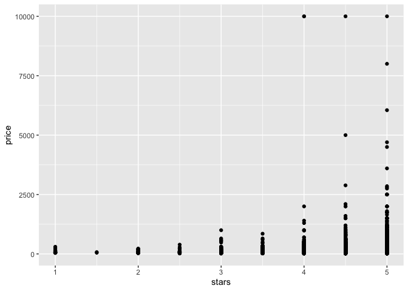

Linear Models
================
Anna Ma
11/16/2021

``` r
library(tidyverse)
```

    ## ── Attaching packages ─────────────────────────────────────── tidyverse 1.3.1 ──

    ## ✓ ggplot2 3.3.5     ✓ purrr   0.3.4
    ## ✓ tibble  3.1.5     ✓ dplyr   1.0.7
    ## ✓ tidyr   1.1.3     ✓ stringr 1.4.0
    ## ✓ readr   2.0.1     ✓ forcats 0.5.1

    ## ── Conflicts ────────────────────────────────────────── tidyverse_conflicts() ──
    ## x dplyr::filter() masks stats::filter()
    ## x dplyr::lag()    masks stats::lag()

``` r
library(p8105.datasets)
```

Load NYC Airbnb data

``` r
data("nyc_airbnb")

nyc_airbnb = 
  nyc_airbnb %>% 
  mutate(stars = review_scores_location / 2) %>%
  rename(
    borough = neighbourhood_group,
    neighborhood = neighbourhood) %>% 
  filter(borough != "Staten Island") %>% 
  select(price, stars, borough, neighborhood, room_type)
```

Visualizations..

``` r
nyc_airbnb %>% 
  ggplot(aes(x = stars, y = price)) +
  geom_point()
```

    ## Warning: Removed 9962 rows containing missing values (geom_point).

<!-- -->

Let’s fit a linear model (usually need to plot more and observe
association between variables before actually fitting the regression)

``` r
fit = lm(price ~ stars + borough, data = nyc_airbnb)

#we can also do summary(fit) to see more information about the regression 

#Putting the result in a dataframe: 
fit %>% 
  broom::tidy() %>% 
  mutate(term = str_replace(term, "borough", "Borough: ")) %>% 
  select(term, estimate, p.value) %>% 
  knitr::kable()
```

| term               |  estimate |   p.value |
|:-------------------|----------:|----------:|
| (Intercept)        | -70.41446 | 0.0000005 |
| stars              |  31.98989 | 0.0000000 |
| Borough: Brooklyn  |  40.50030 | 0.0000022 |
| Borough: Manhattan |  90.25393 | 0.0000000 |
| Borough: Queens    |  13.20617 | 0.1451682 |
