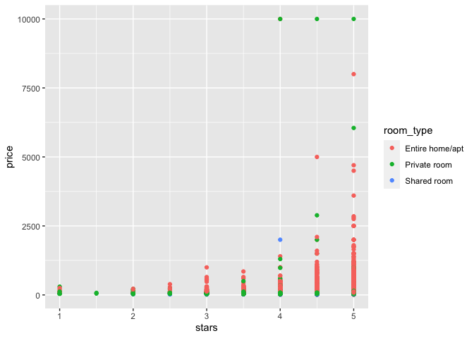

Bootstrapping
================
Anna Ma
11/24/2021

Bootstrap: inference on model parameter, CI, p-value, etc (given the
model, want to find the parameters on it)

Cross validation: give us a sense about how well this model will do on a
different data set (prediction accuracy, wants to compare two model and
find which one is better without p-values or hypothesis tests)

``` r
library(tidyverse)
```

    ## ── Attaching packages ─────────────────────────────────────── tidyverse 1.3.1 ──

    ## ✓ ggplot2 3.3.5     ✓ purrr   0.3.4
    ## ✓ tibble  3.1.5     ✓ dplyr   1.0.7
    ## ✓ tidyr   1.1.3     ✓ stringr 1.4.0
    ## ✓ readr   2.0.1     ✓ forcats 0.5.1

    ## ── Conflicts ────────────────────────────────────────── tidyverse_conflicts() ──
    ## x dplyr::filter() masks stats::filter()
    ## x dplyr::lag()    masks stats::lag()

``` r
library(modelr)
library(mgcv)
```

    ## Loading required package: nlme

    ## 
    ## Attaching package: 'nlme'

    ## The following object is masked from 'package:dplyr':
    ## 
    ##     collapse

    ## This is mgcv 1.8-38. For overview type 'help("mgcv-package")'.

``` r
library(p8105.datasets)
library(patchwork)
```

``` r
n_samp = 250

#constant variance

sim_df_const = 
  tibble(
    x = rnorm(n_samp, 1, 1),
    error = rnorm(n_samp, 0, 1),
    y = 2 + 3 * x + error
  )


#non constant variance
sim_df_nonconst = sim_df_const %>% 
  mutate(
  error = error * .75 * x,
  y = 2 + 3 * x + error
)
```

Make a plot

``` r
sim_df_const %>% 
  ggplot(aes(x = x, y = y)) +
  geom_point()
```

<!-- -->

``` r
sim_df_nonconst %>% 
  ggplot(aes(x = x, y = y)) +
  geom_point()
```

<!-- -->

The left panel shows data with constant variance and the right panel
shows data with non-constant variance.

Fitting a simple linear regression:

``` r
lm(y ~ x, data = sim_df_const) %>% 
  broom::tidy() %>% 
  knitr::kable(digits = 3)
```

| term        | estimate | std.error | statistic | p.value |
|:------------|---------:|----------:|----------:|--------:|
| (Intercept) |    2.038 |     0.088 |    23.115 |       0 |
| x           |    3.049 |     0.064 |    47.274 |       0 |

``` r
lm(y ~ x, data = sim_df_nonconst) %>% 
  broom::tidy() %>% 
  knitr::kable(digits = 3)
```

| term        | estimate | std.error | statistic | p.value |
|:------------|---------:|----------:|----------:|--------:|
| (Intercept) |    2.077 |     0.093 |    22.445 |       0 |
| x           |    3.019 |     0.068 |    44.587 |       0 |

## Use bootstrap for inference on the non-constant modle

``` r
sim_df_nonconst %>% 
  sample_frac(size = 1, replace = TRUE) %>% 
  arrange(x)
```

    ## # A tibble: 250 × 3
    ##         x   error      y
    ##     <dbl>   <dbl>  <dbl>
    ##  1 -1.75   1.34   -1.90 
    ##  2 -1.75   1.34   -1.90 
    ##  3 -1.34  -0.356  -2.39 
    ##  4 -1.34  -0.356  -2.39 
    ##  5 -1.19  -0.0488 -1.62 
    ##  6 -1.16   0.194  -1.27 
    ##  7 -1.16   0.194  -1.27 
    ##  8 -1.08   1.56    0.339
    ##  9 -1.08   1.56    0.339
    ## 10 -0.965  0.513  -0.382
    ## # … with 240 more rows

this give us how many times an observation is observed in the dataset,
running it again will give a different sample because replacement is
true

This is an example of doing bootstrap once

``` r
bootstrap_sample = 
  sim_df_nonconst %>% 
  sample_frac(size = 1, replace = TRUE) %>% 
  arrange(x)

lm(y~x, data = bootstrap_sample)
```

    ## 
    ## Call:
    ## lm(formula = y ~ x, data = bootstrap_sample)
    ## 
    ## Coefficients:
    ## (Intercept)            x  
    ##       1.945        3.213

Use the function to iterate, getting the parameters many times and
eventually get the actual distribution of the intercept and the actural
distribution of the slope

Use function to iterate

``` r
boot_sample = function(df) {
  sample_frac(df, replace = TRUE)
}
```

Now, we we will make a tibble to keep track of everything

``` r
boot_strap_df = 
  tibble(
    strap_number = 1:1000,
    strap_sample = rerun(1000, boot_sample(sim_df_nonconst)))
# rerun the boot_sample function 1000 times 
```

each of the strap\_sample is a slightly different draw with replacement
from the dataframe we started out with.

From here… things are kinda the same as “always”

``` r
boot_strap_results = 
  boot_strap_df %>% 
  mutate(
    models = map(.x = strap_sample, ~lm(y~x, data = .x)),
    results = map(models, broom::tidy)
  ) %>% 
  select(strap_number, results) %>% 
  unnest(results)
```

``` r
boot_strap_results %>%
  ggplot(aes(x = estimate))+
  geom_histogram()+
  facet_grid(~term, scales = "free")
```

    ## `stat_bin()` using `bins = 30`. Pick better value with `binwidth`.

<!-- -->

refit

``` r
lm(y~x, data = sim_df_nonconst) %>% broom::tidy()
```

    ## # A tibble: 2 × 5
    ##   term        estimate std.error statistic   p.value
    ##   <chr>          <dbl>     <dbl>     <dbl>     <dbl>
    ## 1 (Intercept)     2.08    0.0926      22.4 1.17e- 61
    ## 2 x               3.02    0.0677      44.6 2.03e-120

what i think the sample would look like under repeated sampling of the
population:

``` r
boot_strap_results %>% 
  group_by(term) %>% 
  summarize(
    se = sd(estimate)
  )
```

    ## # A tibble: 2 × 2
    ##   term            se
    ##   <chr>        <dbl>
    ## 1 (Intercept) 0.0695
    ## 2 x           0.106

``` r
boot_sample(sim_df_nonconst) %>% 
  ggplot(aes(x = x, y = y)) + 
  geom_point(alpha = .5) +
  stat_smooth(method = "lm")
```

    ## `geom_smooth()` using formula 'y ~ x'

<!-- -->

If we do the same thing on the constant variance simulation, the se of
intercept and x will be close for both bootstrapped and unbootstraped

## Use `modelr`

``` r
sim_df_nonconst %>% 
  bootstrap(n = 1000, id = "strap_number") %>% 
  mutate(
    models = map(.x = strap, ~lm(y~x, data = .x)),
    results = map(models, broom::tidy)
  )
```

    ## # A tibble: 1,000 × 4
    ##    strap                strap_number models results         
    ##    <list>               <chr>        <list> <list>          
    ##  1 <resample [250 x 3]> 0001         <lm>   <tibble [2 × 5]>
    ##  2 <resample [250 x 3]> 0002         <lm>   <tibble [2 × 5]>
    ##  3 <resample [250 x 3]> 0003         <lm>   <tibble [2 × 5]>
    ##  4 <resample [250 x 3]> 0004         <lm>   <tibble [2 × 5]>
    ##  5 <resample [250 x 3]> 0005         <lm>   <tibble [2 × 5]>
    ##  6 <resample [250 x 3]> 0006         <lm>   <tibble [2 × 5]>
    ##  7 <resample [250 x 3]> 0007         <lm>   <tibble [2 × 5]>
    ##  8 <resample [250 x 3]> 0008         <lm>   <tibble [2 × 5]>
    ##  9 <resample [250 x 3]> 0009         <lm>   <tibble [2 × 5]>
    ## 10 <resample [250 x 3]> 0010         <lm>   <tibble [2 × 5]>
    ## # … with 990 more rows

## Airbnb data

``` r
data("nyc_airbnb")

nyc_airbnb = 
  nyc_airbnb %>% 
  mutate(stars = review_scores_location / 2) %>% 
  rename(
    borough = neighbourhood_group,
    neighborhood = neighbourhood) %>% 
  filter(borough != "Staten Island") %>% 
  drop_na(price, stars) %>% 
  select(price, stars, borough, neighborhood, room_type)
```

look at the data with plots first

``` r
nyc_airbnb %>% 
  ggplot(aes(x = stars, y = price, color = room_type)) + 
  geom_point()  
```

<!-- -->

bootstrap first and see if we can understand the relationship between
price and stars, get the linear component and now the distribution of
this slope.

``` r
# bootstrap sampling: give 10 samples with replacement of the same size with the dataset (nyc_airbnb %>% filter(borough == "Manhattan")) and give modle result
airbnb_boot_result = 
nyc_airbnb %>% 
  filter(borough == "Manhattan") %>% 
  modelr::bootstrap(n = 10) %>% 
  mutate(
    models = map(strap, ~ lm(price ~ stars + room_type, data = .x)),
    results = map(models, broom::tidy)) %>% 
  select(results) %>% 
  unnest(results)

# the plot is showing the distribution of the estimated coefitient of stars across all 10 bootstrap samples
ggp_star_est = 
airbnb_boot_result %>% 
  filter(term == "stars") %>% 
  ggplot(aes(x = estimate)) + geom_density()

# the actual data 
ggp_scatter = 
  nyc_airbnb %>% 
  filter(borough == "Manhattan") %>% 
  ggplot(aes(x = stars, y = price, color = room_type)) +geom_point()

ggp_star_est+ggp_scatter 
```

<!-- -->

When we look at the density plot, not quite a normal distribution. Go
back to the lecture (1hr) for explanation on how the density graph is
related to the actual data!
